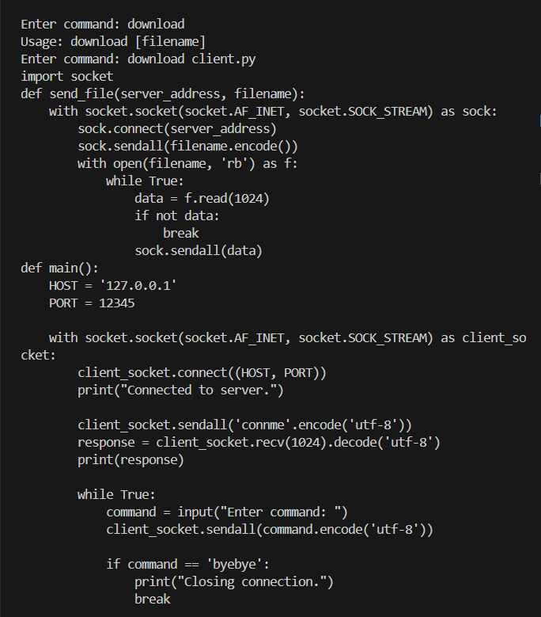
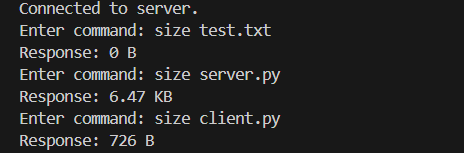
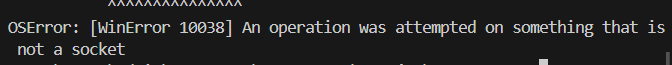
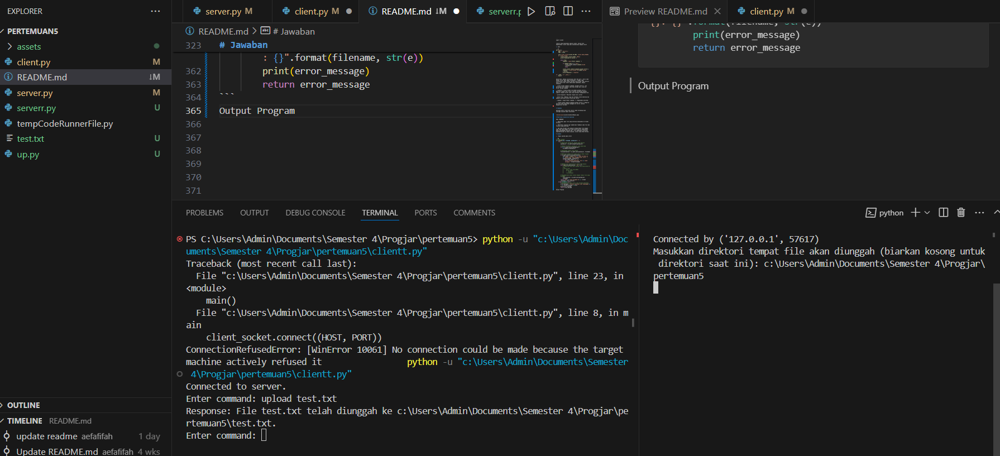
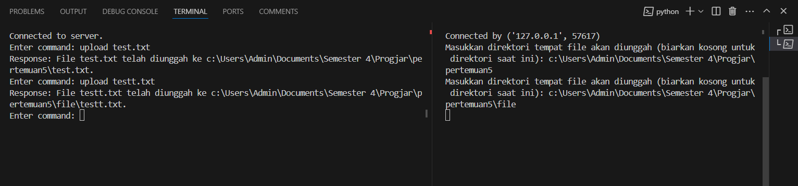
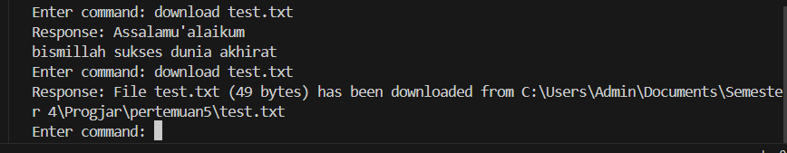
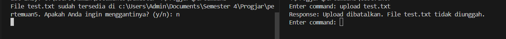
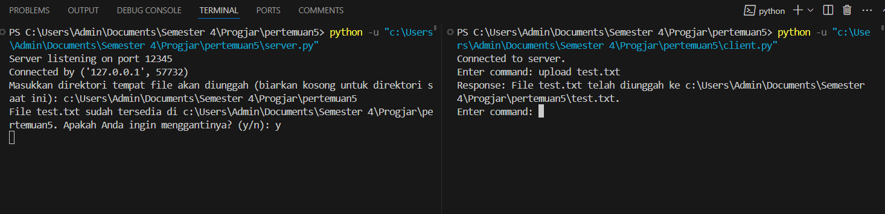
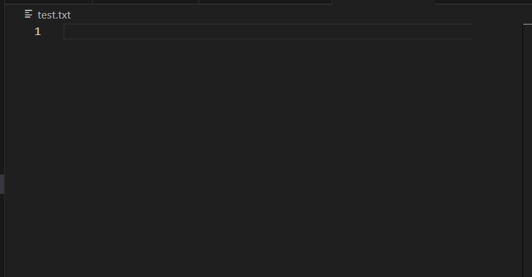
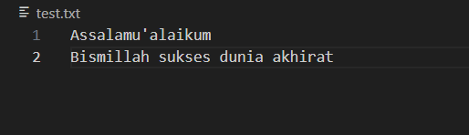

``` sh
Nama : Afifah Fikriyah 
NIM : 1203220051 
```

# Soal 

- buat sebuah program file transfer protocol menggunakan socket programming dengan beberapa perintah dari client seperti berikut
ls : ketika client menginputkan command tersebut, maka server akan memberikan daftar file dan folder 
rm {nama file} : ketika client menginputkan command tersebut, maka server akan menghapus file dengan acuan nama file yang diberikan pada parameter pertama
download {nama file} : ketika client menginputkan command tersebut, maka server akan memberikan file dengan acuan nama file yang diberikan pada parameter pertama
upload {nama file} : ketika client menginputkan command tersebut, maka server akan menerima dan menyimpan file dengan acuan nama file yang diberikan pada parameter pertama
size {nama file} : ketika client menginputkan command tersebut, maka server akan memberikan informasi file dalam satuan MB (Mega bytes) dengan acuan nama file yang diberikan pada parameter pertama
byebye : ketika client menginputkan command tersebut, maka hubungan socket client akan diputus
connme : ketika client menginputkan command tersebut, maka hubungan socket client akan terhubung. 

- buat readme.md dengan memberikan Nama dan nim serta penjelasan dan cara menggunakan setiap command yang tersedia
penilaian
50% : program
50% : readme

- Upload di github dan kumpulkan url repositorinya

# Penjelasan Program 

1. command ls 
```sh
def ls(conn, directory='.'):
    parser = argparse.ArgumentParser(description='List files in a directory')
    parser.add_argument('directory', type=str, nargs='?', default='.')
    args = parser.parse_args()

    files = os.listdir(args.directory)
    files_str = '\n'.join(files)
    conn.sendall(files_str.encode('utf-8'))

```

berada dalam server.py di mana ls berfungsi untuk mengirim daftar list file dan folder dalam direktori tersebut, prosesnya mencakup: 

1. Fungsi yang menerima parameter conn sebagai socket dan directory untuk memeriksa isi dari suatu direktori
2. Membuat objek ArgumentParser untuk mengelola argumen baris perintah dengan deskripsi "List files in a directory"
3. Menambahkan argumen directory yang opsional ke parser. Argumen ini menunjukkan direktori yang ingin ditampilkan dan defaultnya adalah direktori saat ini ('.')
4. args = parser.parse_args(): Mem-parsing argumen dari baris perintah yang diberikan oleh pengguna
5. files = os.listdir(args.directory): Mendapatkan daftar file dalam direktori yang ditentukan dari argumen baris perintah
6. files_str = '\n'.join(files): Menggabungkan daftar nama file menjadi satu string dengan baris baru di antara setiap nama file
7. conn.sendall(files_str.encode('utf-8')): Mengirim string yang berisi daftar file ke koneksi yang diberikan.

output yang dihasilkan dari pemanggilan command ls:


2. command rm 

```sh
def remove_file(filename):
    if os.path.exists(filename):
        os.remove(filename)
        return "File {} has been removed.".format(filename)
    else:
        return "File {} does not exist.".format(filename)

```

command rm berfungsi untuk menghapus sebuah file yang ada di dalam direktori, pertamanya akan mengecek apakah path yang dituju ada ( dibantu dengan library os yang disediakan oleh python) ketika file yang dicari ada maka akan menghapus file tersebut jika tidak maka akan mengembalikan pesan file does not exist 


3. command download 

```sh
def download(conn, filename):
    if os.path.exists(filename):
        with open(filename, 'rb') as f:
            data = f.read(1024)
            while data:
                conn.sendall(data)
                data = f.read(1024)
        return "File {} has been downloaded.".format(filename)
    else:
        return "File {} does not exist.".format(filename)
```

command download berfungsi untuk mendownload sebuah file ( membaca file yang dituju ) 



4. command upload 

```sh
def upload(conn, filename):
    with open(filename, 'wb') as f:
        data = conn.recv(1024)
        while True:
            data = conn.recv(1024)
            if not data:
                break
            f.write(data)
    print("File {} has been uploaded.".format(filename))
```

command upload berfungsi untuk mengupload sebuah file yang akan dibuat, dalam program ini masih terdapat bug di saat file berhasil diupload koneksi antar socket, namun program ini sudah bisa mengupload file dengan berhasil 

 


5. command size 

```sh
def convert_size(size_bytes):
    # Daftar ukuran file 
    units = ['B', 'KB', 'MB', 'GB', 'TB']

    # Perulangan yang mengecek berapa ukuran file
    for unit in units:
    # jika kurang dari 1024 maka b
        if size_bytes < 1024:
            if unit == 'B':
                return "{} {}".format(int(size_bytes), unit)
            else:
                return "{:.2f} {}".format(size_bytes, unit)
        size_bytes /= 1024

    return "{:.2f} {}".format(size_bytes, units[-1])

def get_file_size(filename):
# pengecekan jika file tersedia
    if os.path.exists(filename):
    # memanfaatkan library os untuk mendapat ukuran 
        size_bytes = os.path.getsize(filename)
        # memanggil fungsi convert size
        return convert_size(size_bytes)
    else:
        return "File {} does not exist.".format(filename)
```

command size digunakan untuk mendapatkan ukuran dari suatu file dengan bantuan library os kita dapat mendapatkan ukuran suatu file 



6. command bye bye 

```sh
 elif command[0] == 'byebye':
            response = "Goodbye!"
            conn.sendall(response.encode('utf-8'))
            conn.close()
            break
```

bye bye akan langsung dihandel oleh sebuah fungsi bernama handle conn yang isi fungsi tersebut adalah untuk memeriksa setiap command, dan jika command adalah byebye maka conn.close() berarti mengakhiri hubungan antar socket

 

dan ketika kita mencoba untuk memasukkan command lagi akan error 



7. command connme 

```sh
elif command[0] == 'connme':
            response = "Connection established successfully."
            conn.sendall(response.encode('utf-8'))
            continue  
```
command connme berfungsi untuk memastikan apakah sebuah socket telah terhubung apa tidak 


# Program Server

1. Import Library 

```sh
import argparse
import os
import socket

```
-  import argparse: Mengimpor modul argparse yang digunakan untuk memproses argumen baris perintah.
   
- import os: Mengimpor modul os yang digunakan untuk berinteraksi dengan sistem operasi, seperti mengakses file dan direktori.

-  import socket: Mengimpor modul socket yang digunakan untuk membuat koneksi jaringan.

2. handle conn function 

```sh
def handle_client(conn):
    while True:
        data = conn.recv(1024).decode('utf-8')
        if not data:
            break

        command = data.split()
        if command[0] == 'ls':
            ls(conn, command[1] if len(command) > 1 else '.')
        elif command[0] == 'rm':
            if len(command) > 1:
                response = remove_file(command[1])
            else:
                response = "Usage: rm [filename]"
            conn.sendall(response.encode('utf-8'))    
        elif command[0] == 'upload':
            if len(command) > 1:
                filename = command[1]
                response = upload(conn, filename)
                conn.sendall(response.encode('utf-8'))
            else:
                response = "Usage: upload [filename]"
            conn.sendall(response.encode('utf-8'))
            if response == "ready":
             continue 
        elif command[0] == 'download':
            if len(command) > 1:
                filename = command[1]
                response = download(conn, filename)
            else:
                response = "Usage: download [filename]"
            conn.sendall(response.encode('utf-8'))
        elif command[0] == 'size':
            if len(command) > 1:
                filename = command[1]
                response = get_file_size(filename)
            else:
                response = "Usage: size [filename]"
            conn.sendall(response.encode('utf-8'))
        elif command[0] == 'byebye':
            response = "Goodbye!"
            conn.sendall(response.encode('utf-8'))
            conn.close()
            break
        elif command[0] == 'connme':
            response = "Connection established successfully."
            conn.sendall(response.encode('utf-8'))
            continue  
        else:
         response = "Invalid command."
         conn.sendall(response.encode('utf-8'))
```
sebuah fungsi untuk memeriksa sebuah command 
- yang bila ls, maka akan memanggil fungsi ls dan memberi daftar file 
- yang bila rm, maka akan memanggil fungsi rm dan menghapus file 
- yang bila upload, maka akan memanggil fungsi upload dan mengupload file baru 
- yang bila download, maka akan memanggil fungsi download dan membaca file dituju 
- yang bila size, maka akan memanggil fungsi size untuk mendapatkan ukuran suatu file 
- yang bila byebye maka akan memutuskan hubungan socket 
- yang bila connme maka akan mengirimkan pesan status jika socket aktif 

3. main 

```sh
def main():
    HOST = '127.0.0.1'
    PORT = 12345

    with socket.socket(socket.AF_INET, socket.SOCK_STREAM) as server_socket:
        server_socket.bind((HOST, PORT))
        server_socket.listen()

        print("Server listening on port", PORT)

        while True:
            conn, addr = server_socket.accept()
            print('Connected by', addr)
            handle_client(conn)
            handle_client(conn)

if __name__ == "__main__":
    main()

```
dalam main kita akan menginisialisasikan sebuah host dan port, di mana sebuah socket TCP akan dibuat objeknya dan memanggil fungsi listen untuk mengakses koneksi dari client 
jika koneksi terus berjalan maka socket dan variabel alamat akan menyimpan fungsi accept 
dan di sinilah pengecekan command dipanggil 

# Program Client

1. library 

```
import socket
```

library yang dibutuhkan adalah socket, karena kita membutuhkan client yang akan dikoneksikan kepada server 

2. main 

```sh
def main():
    HOST = '127.0.0.1'  
    PORT = 12345        

    with socket.socket(socket.AF_INET, socket.SOCK_STREAM) as client_socket:
        client_socket.connect((HOST, PORT))
        print("Connected to server.")

        while True:
            command = input("Enter command: ")

            if command.lower() == 'exit':
                client_socket.sendall(command.encode('utf-8'))
                break

            client_socket.sendall(command.encode('utf-8'))
            response = client_socket.recv(1024).decode('utf-8')
            print("Response:", response)

if __name__ == "__main__":
    main()
```

dalam main, adanya inisialisasi host dan port ( harus sama dengan server agar dapat terkoneksi ) jangan lupa inisialisasi objek socket bertipe sock_stream (TCP) berarti antar server dan client memerlukan handshake, adapun tahapnya: 

- client_socket.sendall('command'.encode('utf-8')): Ini bertujuan untuk memberi tahu ada kiriman dari klien ke server berupa command

- response = client_socket.recv(1024).decode('utf-8'): Menerima respons dari server setelah terjadinya koneksi seperti respons server saat klien berhasil mengupload file 

- print(response): Mencetak respons dari server

- while True:: Memulai loop tak terbatas untuk menerima dan mengirim perintah antara klien dan server.

- command = input("Enter command: "): Memasukkan perintah.

-  client_socket.sendall(command.encode('utf-8')): Mengirim perintah yang dimasukkan pengguna ke server setelah mengonversi ke byte.


# Tambahan 

pastikan antar client dan server sudah terhubung baik sehingga program dapat dijalankan


<<<<<<< HEAD


# Modifikasi Upload dan Download 

SOAL TAMBAHAN 

1. Modifikasi agar file yang diterima dimasukkan ke folder tertentu 

2. Modifikasi program agar memberikan feedback nama file dan filesize yang diterima.

3. Apa yang terjadi jika pengirim mengirimkan file dengan nama yang sama dengan file yang telah dikirim sebelumnya? Dapat menyebabkan masalah kah ? Lalu bagaimana solusinya? Implementasikan ke dalam program, solusi yang Anda berikan.

# Jawaban 

1. fungsi upload pada server 

```py
# Fungsi upload
def upload(conn, filename, upload_dir='.'):
    try:
        # Memastikan upload_dir adalah path absolut
        upload_dir = os.path.abspath(upload_dir)
        
        # Membuat direktori upload_dir jika belum ada
        if not os.path.exists(upload_dir):
            os.makedirs(upload_dir)
        
        # Menentukan lokasi file tujuan
        file_destination = os.path.join(upload_dir, filename)
        
        # Memeriksa apakah file sudah ada di lokasi tujuan
        if os.path.exists(file_destination):
            user_input = input("File {} sudah tersedia di {}. Apakah Anda ingin menggantinya? (y/n): ".format(filename, upload_dir))
            if user_input.lower() != 'y':
                return "Upload dibatalkan. File {} tidak diunggah.".format(filename)
        
        # Membuka file untuk ditulis dalam mode binary
        with open(file_destination, 'wb') as f:
            # # Menerima data dari koneksi dan menulisnya ke file
            # while True:
            #     data = conn.recv(1024)
            #     if not data:
            #         break
            #     f.write(data)
        
        # Mengembalikan pesan sukses dengan lokasi file yang diunggah
            file_location = os.path.join(upload_dir, filename)
        return "File {} telah diunggah ke {}.".format(filename, file_location)
    except Exception as e:
        # Mengembalikan pesan error jika terjadi kesalahan
        error_message = "Terjadi kesalahan saat mengunggah {}: {}".format(filename, str(e))
        print(error_message)
        return error_message
```
Output Program



dalam hal ini file telah diupload pada direktori saat ini, lalu bagaimana jika kita mengupload ke folder tertentu?
tentu! jangan lupa untuk membuat folder kosong terlebih dahulu untuk mengetesnya 

pada kali ini kita akan membuat folder bernama file



dan file terupload sempurna di dalam folder tersebut 


2. Fungsi download pada server

```py
def download(conn, filename, download_dir='.'):
    try:
        # Memastikan download_dir adalah path absolut
        download_dir = os.path.abspath(download_dir)
        
        # Membuka file untuk dibaca dalam mode binary
        with open(os.path.join(download_dir, filename), 'rb') as f:
            # Membaca data dari file dan mengirimkannya ke koneksi
            data = f.read(1024)
            while data:
                conn.sendall(data)
                data = f.read(1024)
        
        # Mengembalikan pesan sukses dengan lokasi file yang diunduh
        file_location = os.path.join(download_dir, filename)
        file_size = os.path.getsize(file_location)
        return "File {} ({} bytes) has been downloaded from {}".format(filename, file_size, file_location)
    except Exception as e:
        # Mengembalikan pesan error jika terjadi kesalahan
        error_message = "Terjadi kesalahan saat mengunduh {}: {}".format(filename, str(e))
        print(error_message)
        return error_message

```

jika pada bab sebelumnya, kita telah membuat download yang sudah bisa membaca isi file kali ini kita hasil dari downloadan tersebut akan kita tambahkan menjadi nama file serta ukurannya 



dapat dilihat ketika awal download ia akan membaca isi dari download tersebut, yang kemudian ketika kita coba untuk mendownload lagi ia akan menampilkan pesan bahwa file telah terdownload 

3. Upload File 

pada bagian upload file 
```py
 # Memeriksa apakah file sudah ada di lokasi tujuan
        if os.path.exists(file_destination):
            user_input = input("File {} sudah tersedia di {}. Apakah Anda ingin menggantinya? (y/n): ".format(filename, upload_dir))
            if user_input.lower() != 'y':
                return "Upload dibatalkan. File {} tidak diunggah.".format(filename)

```
dapat dilihat ia akan mengecek apakah di dalam folder tersebut terdapat file yang telah tersedia atau belum, yang jika sudah tersedia ia akan meminta persetujuan jika yang dipilih adalah iya, ia akan menimpa file lama namun jika tidak, ia akan membatalkan penguploadan





bukti test.txt ditimpa



ia menjadi file kosong lagi, padahal sebelumnya memiliki isi 




=======

>>>>>>> 69a46304711396c14f4696d9184a21b4023600dc


